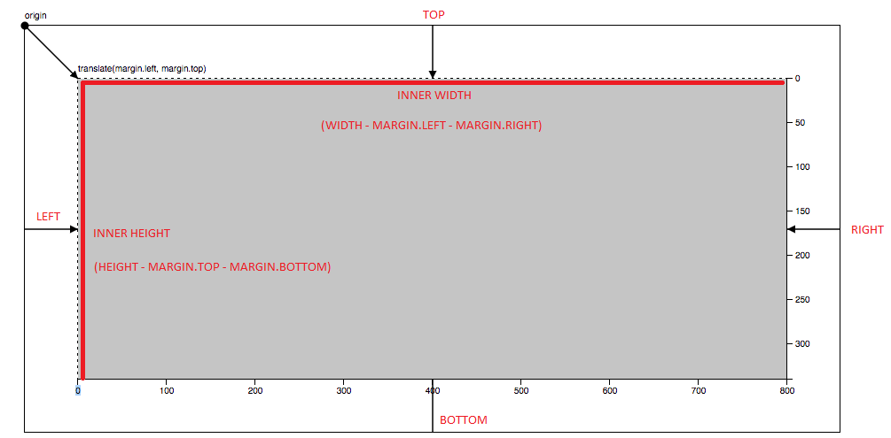

# D3 for Data Visualization in CSGE

## Overview

#### D3

D3 binds data and graphical elements to DOMs. 

#### Vector Graphics and SVG

Vector graphics can be edited in a text editor since there is no worry regarding pixelation (rasters). Scalable Vector Graphics (SVG) have graphical elements to render images, such as lines, circles, rectangles, polygons, etc. Styling an SVG can be done through using CSS. 

Consider an SVG as some sort of a [viewport](https://en.wikipedia.org/wiki/Viewport) (with some defined width x height) where you can append graphical elements. For example, the ```<g>``` element can be used to group graphics together within an SVG. 

#### Shapes 

Thus far the only two shaped used in this repo are rectangles and circles.

###### Rectangle 
- Referred to as ```rect``` in D3
- The following information is required:
  - position
  - width
  - height

###### Circle
- Referred to as ```circle``` in D3
- The following information is required:
  - point coordinates (cx, cy)
  - radius

#### Styling non-SVG Elements

There exists two ways to modify a non-SVG element's styling: 

1. ```.attr()```
   - Modify attributes of an element 
2. ```.style()```
   - Modify CSS of an element

**Note:** Before modifying a non-SVG element's styling, be sure to use ```.select()```. 

#### Binding Data

Many important methods exist in D3 for working with data:

1. ```.selectAll().data()```
   - Begin by selecting an element in the SVG and then data join to pass in your array of data
2. ```enter().append()```
   - Add any sort of element to the DOM
     - Examples: 
       - ```rect```
       - ```circle```
       - ```<svg>```
       - ```<p>```
3. ```.exit().remove()``` **(might not need to use this?)**
   - Remove unwanted surplus of elements 

#### Scales

Obviously scale selection will depend on what you aim to visualize, so I won't go too in-depth on scales in D3 and the many functions that exist. 

Scales need domain, range, and sometimes padding (based on preference and / or the type of scale function you used). 

###### Domain
- Set of values to be mapped

###### Range 
- Think in terms of pixel positioning
- Set of values to return 
  - Examples:
    - (x, y) pixel position

###### Padding
- Spacing between elements

**Note:** You'll need one scale for ```x```, and one scale for ```y```. 

#### Axis

An axis can be left, right, bottom, and top for orientation. You can also modify the tick marks placed on an axis. 

Examples:
- ```d3.axisLeft()``` would be composed of your ```y scale``` to produce a ```y-axis```.

#### Margin Convention 




**Source:** [Adam Mescher (2019)](https://gist.github.com/AdamMescher/d6f432d169743937f191cab778462d38)
**Modified By:** Omar Kawach (2021)

## Author(s)

Omar Kawach

## References

[University of Wisconsin](https://website.education.wisc.edu/~swu28/d3t/concept.html) - A Beginner's Guide to Using D3

[D3.js Graph Gallery](https://www.d3-graph-gallery.com/barplot) - Barchart
